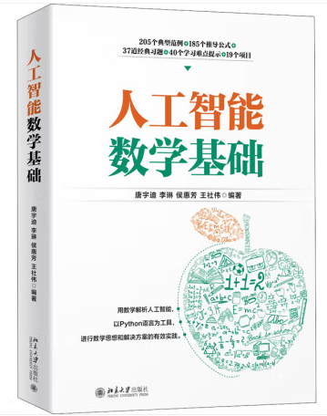

# 人工智能数学基础

## 目录
- 第1 章 人工智能与数学基础..........１
  - 1.1 什么是人工智能............................ 2
  - 1.2 人工智能的发展 ............................ 2
  - 1.3 人工智能的应用 ............................ 4
  - 1.4 学习人工智能需要哪些知识 ............. 5
  - 1.5 为什么要学习数学 ......................... 7
  - 1.6 本书包括的数学知识 ...................... 8
- 第 1 篇
## 基础篇................................................. 9
- 第 2 章 高等数学基础 ................. １0
  - 2.1 函数.......................................... 11
  - 2.2 极限..........................................13
  - 2.3 无穷小与无穷大...........................17
  - 2.4 连续性与导数..............................19
  - 2.5 偏导数...................................... 24
  - 2.6 方向导数................................... 27
  - 2.7 梯度......................................... 29
  - 2.8 综合实例—梯度下降法求函数的最小值..................31
  - 2.9 高手点拨................................... 35
  - 2.10 习题....................................... 38
- 第 3 章 微积分..............................39
  - 3.1 微积分的基本思想 ....................... 40
  - 3.2 微积分的解释..............................41
  - 3.3 定积分...................................... 42
  - 3.4 定积分的性质............................. 44
  - 3.5 牛顿—莱布尼茨公式.................... 45
  - 3.6 综合实例—Python 中常用的定积分求解方法................... 49
  - 3.7 高手点拨....................................51
  - 3.8 习题 ........................................ 52
- 第 4 章 泰勒公式与拉格朗日乘子法..............................53
  - 4.1 泰勒公式出发点.......................... 54
  - 4.2 一点一世界................................ 54
  - 4.3 阶数和阶乘的作用....................... 59
  - 4.4 麦克劳林展开式的应用..................61
  - 4.5 拉格朗日乘子法.......................... 63
  - 4.6 求解拉格朗日乘子法.................... 64
  - 4.7 综合实例—编程模拟实现 sinx 的n 阶泰勒多项式并验证结果.................. 67
  - 4.8 高手点拨 ................................... 68
  - 4.9 习题 ......................................... 68
## 第2篇 核心篇............................................................... 69
- 第 5 章 将研究对象形式化—线性代数基础 ..........................70
  - 5.1 向量..........................................71
  - 5.2 矩阵......................................... 73
  - 5.3 矩阵和向量的创建....................... 77
  - 5.4 特殊的矩阵................................ 85
  - 5.5 矩阵基本操作..............................91
  - 5.6 转置矩阵和逆矩阵....................... 96
  - 5.7 行列式..................................... 101
  - 5.8 矩阵的秩..................................104
  - 5.9 内积与正交...............................108
  - 5.10 综合实例—线性代数在实际问题中的应用 ....................................... 114
  - 5.11 高手点拨 ................................ 121
  - 5.12 习题......................................126
- 第 6 章 从数据中提取重要信息—特征值与矩阵分解..........127
  - 6.1 特征值与特征向量 .....................128
  - 6.2 特征空间..................................133
  - 6.3 特征值分解...............................133
  - 6.4 SVD 解决的问题.......................135
  - 6.5 奇异值分解（SVD）..................136
  - 6.6 综合实例 1—利用 SVD 对图像进行压缩 .......................................140
  - 6.7 综合实例 2—利用 SVD 推荐商品 .......................................143
  - 6.8 高手点拨..................................150
  - 6.9 习题 .......................................154
- 第 7 章 描述统计规律 1—概率论基础................................155
  - 7.1 随机事件及其概率 ......................156
  - 7.2 条件概率.................................. 161
  - 7.3 独立性.....................................162
  - 7.4 随机变量..................................165
  - 7.5 二维随机变量............................173
  - 7.6 边缘分布..................................177
  - 7.7 综合实例—概率的应用.............180
  - 7.8 高手点拨.................................. 181
  - 7.9 习题........................................184
- 第 8 章 描述统计规律 2—随机变量与概率估计........................185
  - 8.1 随机变量的数字特征 ..................186
  - 8.2 大数定律和中心极限定理.............193
  - 8.3 数理统计基本概念......................199
  - 8.4 最大似然估计........................... 203
  - 8.5 最大后验估计........................... 206
  - 8.6 综合实例 1—贝叶斯用户满意度预测 ...................................... 209
  - 8.7 综合实例 2—最大似然法求解模型参数 .......................................217
  - 8.8 高手点拨 ................................ 222
  - 8.9 习题 ....................................... 224
# 第 3 篇 提高篇............................................................. 225
- 第 9 章 随机变量的几种分布...... 226
  - 9.1 正态分布 ................................ 227
  - 9.2 二项分布................................. 240
  - 9.3 泊松分布................................. 250
  - 9.4 均匀分布..................................261
  - 9.5 卡方分布................................. 266
  - 9.6 Beta 分布 .............................. 273
  - 9.7 综合实例—估算棒球运动员的击中率 ...................................... 283
  - 9.8 高手点拨 ................................ 285
  - 9.9 习题 ...................................... 286
- 第 10 章 数据的空间变换—核函数变换............................. 287
  - 10.1 相关知识简介 ......................... 288
  - 10.2 核函数的引入 ......................... 290
  - 10.3 核函数实例............................ 290
  - 10.4 常用核函数.............................291
  - 10.5 核函数的选择......................... 294
  - 10.6 SVM 原理 ............................ 295
  - 10.7 非线性 SVM 与核函数的引入.... 305
  - 10.8 综合实例—利用 SVM 构建分类
问题......................................310
  - 10.9 高手点拨................................315
  - 10.10 习题 ................................... 322
- 第 11 章 熵与激活函数 .............. 323
  - 11.1 熵和信息熵............................ 324
  - 11.2 激活函数 ............................... 328
  - 11.3 综合案例—分类算法中信息熵的应用...................................... 339
  - 11.4 高手点拨 ................................341
  - 11.5 习题 ..................................... 342
# 第4篇 应用篇............................................................. 333
- 第 12 章 假设检验 ..................... 344
  - 12.1 假设检验的基本概念................. 345
  - 12.2 Z 检验 ...................................351
  - 12.3 t 检验 ................................... 353
  - 12.4 卡方检验............................... 358
  - 12.5 假设检验中的两类错误 ..............361
  - 12.6 综合实例 1—体检数据中的假设检验问题..................................... 363
  - 12.7 综合实例 2—种族对求职是否有影响..................................... 369
  - 12.8 高手点拨............................... 372
  - 12.9 习题..................................... 374
  - 13 章 相关分析...................... 375
  - 13.1 相关分析概述.......................... 376
  - 13.2 皮尔森相关系数....................... 378
  - 13.3 相关系数的计算与假设检验........ 379
  - 13.4 斯皮尔曼等级相关.................... 385
  - 13.5 肯德尔系数............................. 392
  - 13.6 质量相关分析.......................... 396
  - 13.7 品质相关分析.......................... 400
  - 13.8 偏相关与复相关....................... 403
  - 13.9 综合实例—相关系数计算........ 405
  - 13.10 高手点拨.............................. 407
  - 13.11 习题..................................... 408
- 第 14 章 回归分析......................409
  - 14.1 回归分析概述...........................410
  - 14.2 回归方程推导及应用..................412
  - 14.3 回归直线拟合优度.....................416
  - 14.4 线性回归的模型检验..................417
  - 14.5 利用回归直线进行估计和预测......419
  - 14.6 多元与曲线回归问题..................421
  - 14.7 Python 工具包....................... 426
  - 14.8 综合实例—个人医疗保费预测任务...................................... 432
  - 14.9 高手点拨................................ 444
  - 14.10 习题..................................... 446
- 第 15 章 方差分析......................449
  - 15.1 方差分析概述.......................... 448
  - 15.2 方差的比较............................. 450
  - 15.3 方差分析.................................451
  - 15.4 综合实例—连锁餐饮用户评级分析...................................... 460
  - 15.5 高手点拨................................ 464
  - 15.6 习题...................................... 466
- 第 16 章 聚类分析......................469
  - 16.1 聚类分析概述.......................... 468
  - 16.2 层次聚类................................ 470
  - 16.3 K-Means 聚类...................... 484
  - 16.4 DBSCAN 聚类....................... 494
  - 16.5 综合实例—聚类分析.............. 499
  - 16.6 高手点拨.................................512
  - 16.7 习题.......................................512
- 第 17 章 贝叶斯分析....................513
  - 17.1 贝叶斯分析概述........................514
  - 17.2 MCMC 概述.......................... 520
  - 17.3 MCMC 采样 ......................... 525
  - 17.4 Gibbs 采样........................... 529
  - 17.5 综合实例—利用 PyMC3 实现随机模拟样本分布......................... 532
  - 17.6 高手点拨............................... 539
  - 17.7 习题..................................... 540

